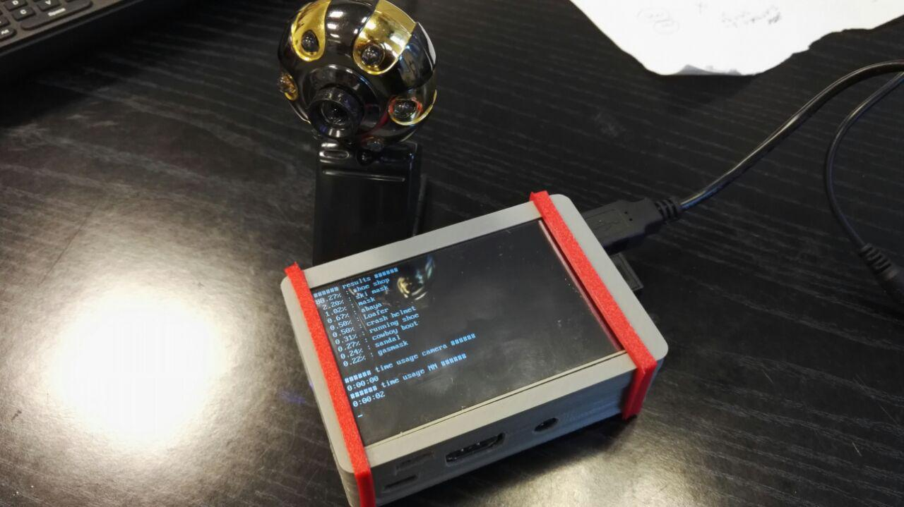
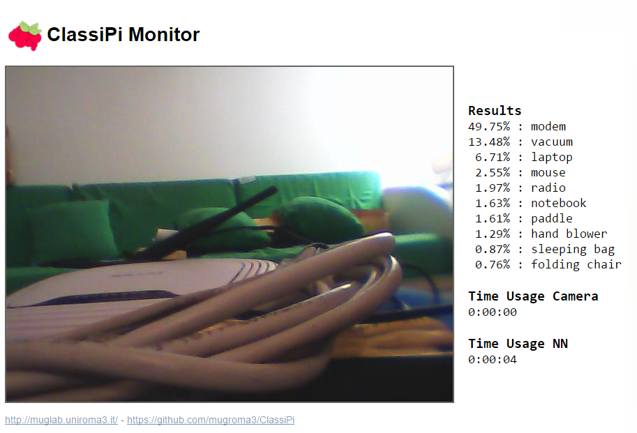

# ClassiPi 

A robot that can understand what's in front of it thanks to a convolutional neural network (Inception model V3 by Google).

Everything runs with Python3 on Raspberry Pi 3 with a usb webcam.

Requires Python3 with pygame and PIL and tensorflow or tensorflow-gpu, Node.js with forever and other libraries depending on your environment. 

Inception model V3 is a CNN by Google trained using ImageNet and impossible to train on an ordinary PC. We instead download the pre-trained Inception model and use it to classify images with a very simple python script. 
We provide a continuous stream of pictures capturing them from a webcam and the classification of what the robot is looking at is provided on a screen and also used to look around in order to find a target object. 

# How does it work?
The repository includes a Python3 script that automatically downloads (only the first time) and runs the neural network, having it classify any image that a connected camera can capture. 
There is also a Node.js server that can be used to see the image that is currently being classified and its classification (like in the screenshot below). 
In the ShellScripts folder there is a script that automatically launches the server in background and the Python3 script in foreground.

